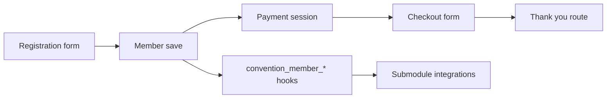

# Architecture Overview

ConReg uses custom tables and service classes, not Drupal content entities.

## Core building blocks

| Area | Implementation |
|---|---|
| Domain object | `Drupal\conreg\Member` (`stdClass`-based) |
| Storage services | `MemberStorage`, `EventStorage`, `AddonStorage`, `UpgradeStorage` |
| Event config | `conreg.settings.{eid}` (core keys schema-backed, integration keys partly runtime-only) |
| Extension points | `hook_convention_member_added/updated/deleted` |
| Payment | Stripe Checkout + `conreg_payments*` tables |

## High-level flow

## Implementation notes

- Parent code invokes `convention_member_added`, not
  `convention_member_inserted`.
- Queue API is not used in current core architecture.
