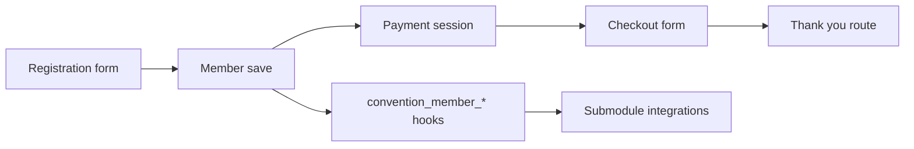

# Architecture Overview

ConReg uses custom tables and service classes, not Drupal content entities (the one
exception is `conreg_mailing_list`'s `conreg_subscription_rule`, a config entity — see
`docs/architecture/data-model.md`).

## Core building blocks

| Area | Implementation |
|---|---|
| Domain object | `Drupal\conreg\Member` (`stdClass`-based) |
| Storage services | `MemberStorage`, `EventStorage`, `AddonStorage`, `UpgradeStorage` |
| Event config | `conreg.settings.{eid}` (core keys schema-backed, integration keys partly runtime-only) |
| Pricing | `PricingService` + `MemberPricingRule`/`PricingAdjustment` plugins — see `docs/architecture/pricing.md` |
| Extension points | `hook_convention_member_added/updated/deleted` — most subscribers act directly; `conreg_mailing_list` instead fans `convention_member_added` out into a queue-driven subscription pipeline (see below) |
| Payment | Stripe Checkout + `conreg_payments*` tables |

## High-level flow

```mermaid
flowchart LR
  reg[Registration form] --> member[Member save]
  member --> pay[Payment session]
  pay --> checkout[Checkout form]
  checkout --> thanks[Thank you route]
  member --> hooks[convention_member_* hooks]
  hooks --> subs[Submodule integrations]
```

## Implementation notes

- Parent code invokes `convention_member_added`, not
  `convention_member_inserted`.
- Core registration/payment flow doesn't use the Queue API. `conreg_mailing_list` does:
  `MailingListSubscriptionWorker` processes queued provider subscriptions on cron.
