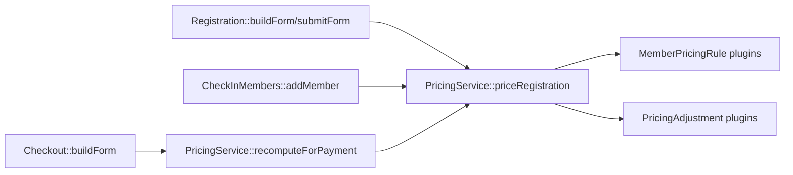

# Pricing

## What it adds

| Area | Details |
|---|---|
| Service | `conreg.pricing` (`PricingServiceInterface`/`PricingService`) — calculates registration pricing |
| Plugin types | `MemberPricingRule`, `PricingAdjustment` — see `docs/development/plugins.md` for the contracts |
| Value objects | `Drupal\conreg\Pricing\*` — `PricingSubject`, `PricingContext`, `PriceLine`, `PriceAdjustment`, `MemberPriceResult`, `PricingResult` |

Pricing used to be calculated inline in `Registration::getAllMemberPrices()`/
`getMemberPrice()`, working directly off raw form values and returning
`stdClass` objects. That logic is now split into plugins behind
`PricingService`, so a new pricing rule (an age discount, a promo code, an
add-on type) can be added without editing `Registration.php`, and the same
calculation can run against either live form input or already-persisted
member data.

## Plugins

`MemberPricingRule` (`BaseTypePricingRule` for type/day pricing,
`AddonPricingRule` for a member's own add-ons) and `PricingAdjustment`
(`NthMemberFreeAdjustment`) — see `docs/development/plugins.md` for the
plugin contracts, file locations, and how weight ordering composes them.

Behavior specific to pricing, not general to the plugin mechanism:

- An adjustment always reduces a member's *total*, never the raw
  per-category breakdown returned by a rule — `MemberPriceResult::basePrice()`/
  `addOnPrice()` always reflect what a rule actually priced; only the
  derived totals (`price()`, `priceMinusFree()`, `basePriceMinusFree()`)
  move. `NthMemberFreeAdjustment` sorts eligible members (base price > 0)
  by price descending, ties broken by member number ascending, and zeroes
  out the base price - not add-ons - on every Nth matching member.
- Global (sitewide, not per-member) add-ons are a fixed part of
  `PricingService` itself rather than a plugin — they're a single
  config-driven calculation, not something a submodule extends.

## Where it's called from

- **Registration** builds a `PricingSubject` per member from form values
  (`PricingSubject::fromFormValues()`) and calls `priceRegistration()` for
  both the live price display and the authoritative submit-time
  calculation. Display markup (translated strings, HTML) is built in the
  form layer from the numeric `PricingResult` — the service itself returns
  plain numbers and machine strings only.
- **CheckInMembers::addMember()** (admin-added, unpaid members) goes
  through the same `priceRegistration()` call via
  `PricingSubject::fromCheckInFormValues()`, so it now picks up add-ons and
  the nth-free discount the same as ordinary registration — it used to have
  its own simplified, drifted copy of just the type/day pricing.
- **Checkout::buildForm()** calls `recomputeForPayment()` before building
  Stripe line items, to guard against a member's pricing-relevant details
  (most importantly their type) having been edited by an admin after
  registration but before payment completed. It rebuilds each member's
  `PricingSubject` from their persisted row (`PricingSubject::fromPersistedMember()`)
  and re-runs the same rules/adjustments; on drift it updates the
  `PaymentLine` amount, the `Payment` total, and the member's own
  `member_price`/`member_total` columns, and logs the change to
  `logger.channel.conreg`. Only `'member'`-type payment lines are
  reconciled this way — add-on line amounts are left as originally
  persisted. If a member's type can no longer be resolved (e.g. deleted
  from config since they registered), that member is skipped rather than
  blocking payment for the rest of the group.

## Implementation notes

- `PricingContext` carries the raw `ConregOptions::memberTypes()->types`
  array as-is rather than wrapping it in a strict typed class — that data
  is already an intentionally open, config-shaped contract that submodules
  extend by adding properties, and a strict wrapper would just reintroduce
  the "have to change core code to extend it" problem one layer down.
- `Addons::getAllAddonPrices()` (the old per-member add-on total function)
  is no longer called by production code — `AddonPricingRule` replaced it —
  but the method itself hasn't been deleted, since a Kernel test
  (`FormBuildTest`) still calls it directly.
- There is currently no admin UI for enabling/disabling plugins, reordering
  them, or configuring plugin-specific settings — plugins are still
  discovered automatically and configured through the same event
  configuration (`discount.*`, `add-ons`) as before the refactor. A
  management UI is tracked as a follow-up.
