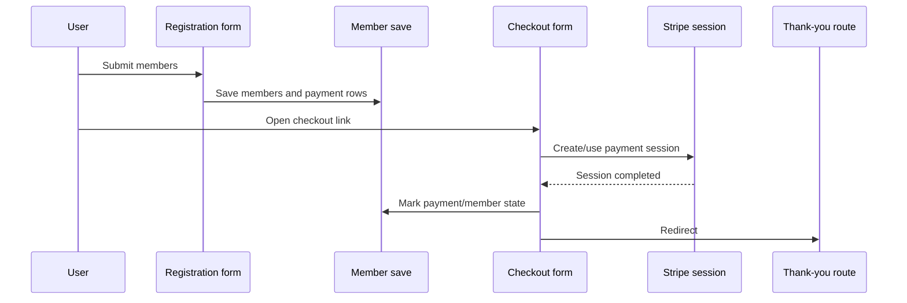

# Registration and Payments

## Main routes

| Step | Route |
|---|---|
| Register | `conreg_register` (`members/register/{eid}`) |
| Checkout | `conreg_checkout` (`members/checkout/{payid}/{key}`) |
| Thank you | `conreg_thanks` (`members/thanks/{eid}`) |

Variants exist for fan table and portal flows using a `return` context.

## Sequence

## Implementation notes

- Zero-balance checkout completes without a Stripe redirect.
- Auto-approval behavior is config driven (`payments.auto_approve`).
