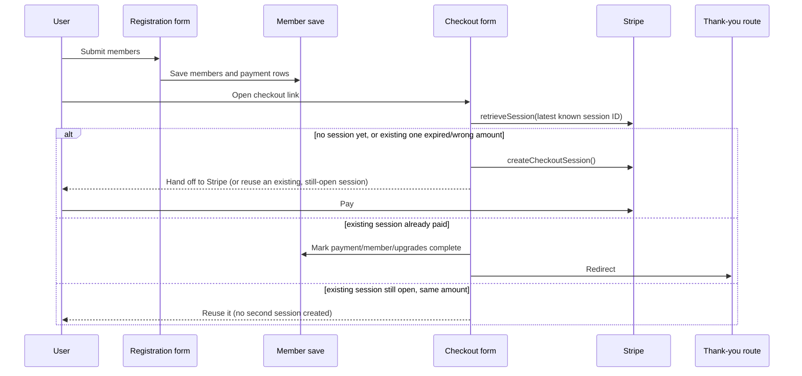

# Registration and Payments

## Main routes

| Step | Route |
|---|---|
| Register | `conreg_register` (`members/register/{eid}`) |
| Checkout | `conreg_checkout` (`members/checkout/{payid}/{key}`) |
| Thank you | `conreg_thanks` (`members/thanks/{eid}`) |

Variants exist for fan table and portal flows using a `return` context.

## Sequence

```mermaid
sequenceDiagram
  participant U as User
  participant R as Registration form
  participant M as Member save
  participant C as Checkout form
  participant S as Stripe
  participant T as Thank-you route
  U->>R: Submit members
  R->>M: Save members and payment rows
  U->>C: Open checkout link
  C->>S: retrieveSession(latest known session ID)
  alt no session yet, or existing one expired/wrong amount
    C->>S: createCheckoutSession()
    C-->>U: Hand off to Stripe (or reuse an existing, still-open session)
    U->>S: Pay
  else existing session already paid
    C->>M: Mark payment/member/upgrades complete
    C->>T: Redirect
  else existing session still open, same amount
    C-->>U: Reuse it (no second session created)
  end
```

Every visit to the checkout route re-checks that specific payment's own
most recently created session directly via `StripeService::retrieveSession()`
- there is no Stripe webhook, and nothing scans Stripe's global events
list. This was a deliberate choice to keep Stripe configuration simple;
see "Reconciliation fallback" below for what covers the gap that leaves.

## Implementation notes

- Zero-balance checkout completes without a Stripe redirect.
- Auto-approval behavior is config driven (`payments.auto_approve`).
- Before building Stripe line items, checkout recomputes each member's
  price from their current persisted data (not the original registration
  submission), so an admin edit to a member's pricing-relevant details
  after registration isn't charged at a stale price. See
  `docs/architecture/pricing.md`.
- A payment can have more than one Stripe session recorded against it in
  `conreg_payment_sessions` (e.g. an earlier one expired, or its amount no
  longer matches after a pricing recompute) - `PaymentStorage::loadSessionIds()`
  returns them most-recent-first, and only the latest is ever checked or
  reused. Checkout deliberately reuses a still-open, same-amount session
  rather than always creating a new one, so a double-click, a page reload
  during the "Transferring to Stripe" wait, or reopening the payment link
  in a second tab can't produce two live sessions - and so two separate
  successful payments - for the same payment record.

## Reconciliation fallback

Checking a session only happens when someone visits the checkout route -
if a member pays on Stripe's hosted page but their browser never returns
(closed tab, network drop), nothing above would ever revisit that payment.
`PaymentReconciliationCronHooks` (`#[Hook('cron')]`) calls
`PaymentCompletionService::reconcilePendingPayments()` on every cron run,
which sweeps unpaid payments between 10 minutes and 7 days old, checks
each one's latest session directly, and marks it complete if Stripe now
reports it paid. `PaymentCompletionService` is also what `Checkout` itself
calls to mark a payment complete, so both paths share the same completion
logic (payment/member/upgrade state, confirmation email, portal role
grant). Marking is idempotent either way - `is_paid`/`paidDate` are only
ever set once, so a member returning to checkout normally after cron has
already caught their payment just sees the thank-you page as usual.
