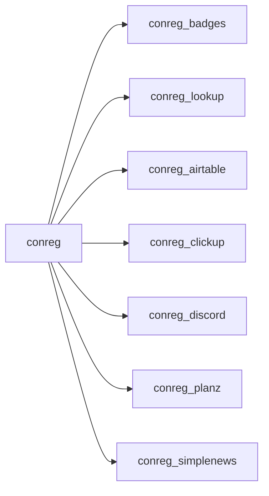

# ConReg Documentation

ConReg is a Drupal 10.1/11 convention registration project with one parent
module (`conreg`) and optional submodules for badges, lookup, Airtable,
ClickUp, Discord, PlanZ, and Simplenews integration.

## What ConReg provides

- Multi-event registration (`conreg_events`) with per-event config.
- Member lifecycle: register, pay, approve, check in, and self-service portal.
- Operational workflows: admin member management, reports, mailouts, bulk email.
- Integrations implemented as hook subscribers in submodules.

## Audience guide

| Role | Start here | Focus |
|---|---|---|
| Developers | `architecture/overview.md` | Data model, services, hooks, routes |
| Site builders | `site-building/events.md` | Event config, types/classes, add-ons |
| Site admins | `administration/members.md` | Day-to-day operations and reporting |

## Module map

## Notes

- Core member data is stored in custom tables, not Drupal content entities.
- See `README.txt` as legacy context; this docs set is the primary reference.
