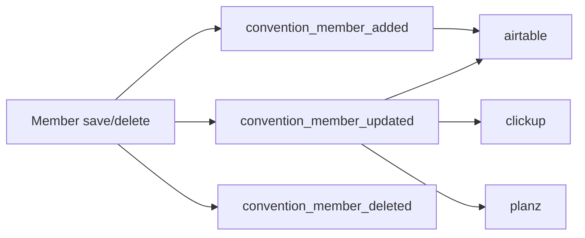

# Submodules Overview

All submodules depend on `conreg` and extend behavior through routes, forms,
schema additions, and member lifecycle hooks.

## Submodule map

| Module | Main responsibility |
|---|---|
| `conreg_airtable` | Sync member records with Airtable |
| `conreg_badges` | Badge names list/export/print tools |
| `conreg_clickup` | Create/update ClickUp tasks from options |
| `conreg_discord` | Discord invite generation and email sending |
| `conreg_lookup` | Staff member lookup UI |
| `conreg_planz` | PlanZ/Zambia bridge and invite flow |
| `conreg_simplenews` | Packaging stub; parent module hosts logic |

## Hook propagation

